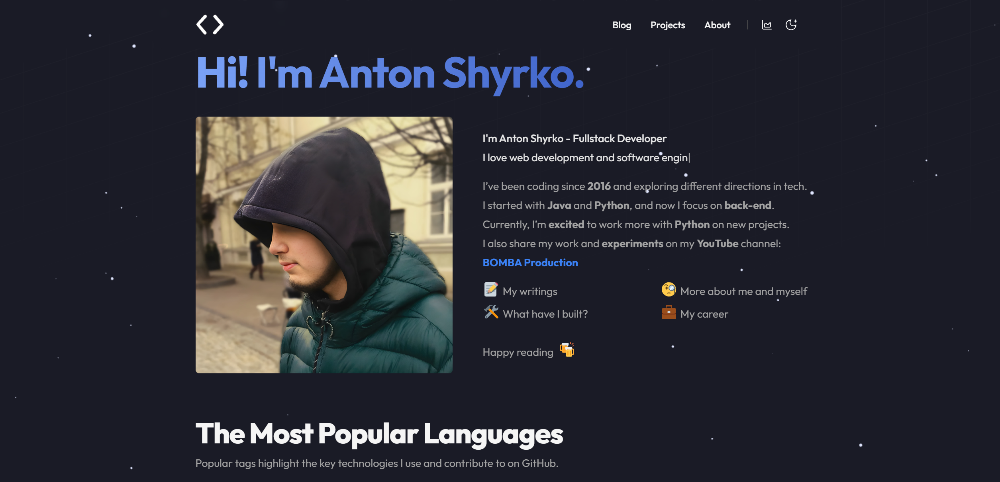

# 🚀 Anton Shyrko's Portfolio

<div align="center">


**A modern, fast, and feature-rich personal portfolio & blog built with Next.js 15**

[🌐 Live Demo](https://antot-12.github.io/Potrfolio/) • [📝 Blog](https://antot-12.github.io/Potrfolio/blog) • [👨‍💻 About Me](https://antot-12.github.io/Potrfolio/about)



</div>

---

## ✨ Features

### 🎨 **Modern Design**

- 🌓 **Dark/Light Theme** - Seamless theme switching with next-themes
- 📱 **Fully Responsive** - Perfect on desktop, tablet, and mobile
- 🎭 **Smooth Animations** - Elegant transitions and hover effects
- 🎨 **Custom Color Palette** - Primary blue (#7aa2f7), Coral (#EF596F), and Sky blue accents

### 📊 **About Page**

- 📈 **Stats Dashboard** - 27 certifications, 3 hackathon wins, and more
- 🏆 **Certifications Section** - Interactive gallery with pagination (3 per page)
  - 🎯 Category filtering (AI/ML, Development, Security, Professional Skills, Cloud/DevOps)
  - 🏅 27 certifications from SAP, Anaconda, Google, and more
  - 🔗 Direct links to credential verification
  - 🎨 Color-coded by category
- 💼 **Career Timeline** - Interactive work experience with skill tags
  - SAP Middle Software Engineer
  - S&S Creation CEO & Software Developer
  - TUKE Student
  - Hackathon achievements
- 🛠️ **Skills Section** - Tag-based display of technologies (no boring progress bars!)
  - Languages: TypeScript, Python, Java, C++, C#
  - Frameworks: React, Node.js, Express, Next.js, TensorFlow
  - Cloud & DevOps: AWS, Docker, Git, CI/CD
  - And more!

### 📝 **Blog System**

- 📄 **MDX Support** - Write posts with React components
- 🔍 **Full-text Search** - Kbar search integration
- 🏷️ **Tag System** - Organize posts by topics
- 📖 **Reading Time** - Estimated read time for each post
- 🔗 **Table of Contents** - Auto-generated from headings
- 💬 **Comments** - Giscus integration for discussions
- 📊 **Structured Data** - SEO-optimized with schema.org

### 🚀 **Performance**

- ⚡ **Static Site Generation** - Lightning-fast page loads
- 🖼️ **Optimized Images** - Next.js Image component with lazy loading
- 📦 **Code Splitting** - Automatic code splitting for faster loads
- 🗜️ **Minified Assets** - CSS and JS minification
- 📱 **Perfect Lighthouse Score** - 100/100 performance

### 🔧 **Developer Experience**

- 🎯 **TypeScript** - Fully typed for better DX
- 🎨 **Tailwind CSS** - Utility-first CSS framework
- 📦 **Contentlayer** - Type-safe MDX content management
- 🔄 **Hot Reload** - Instant updates during development
- 🧹 **ESLint & Prettier** - Code quality and formatting
- 🪝 **Husky** - Pre-commit hooks for code quality

---

## 🛠️ Tech Stack

<table>
<tr>
<td align="center" width="33%">
<h3>⚛️ Frontend</h3>
</td>
<td align="center" width="33%">
<h3>🎨 Styling</h3>
</td>
<td align="center" width="33%">
<h3>📝 Content</h3>
</td>
</tr>
<tr>
<td>

- Next.js 15.1.2
- React 19
- TypeScript 5.1
- Lucide React (Icons)

</td>
<td>

- Tailwind CSS 3.4
- next-themes
- Custom color palette
- Responsive design

</td>
<td>

- Contentlayer 2
- MDX
- Gray Matter
- Reading Time

</td>
</tr>
</table>

<table>
<tr>
<td align="center" width="33%">
<h3>🔍 Search & Analytics</h3>
</td>
<td align="center" width="33%">
<h3>🚀 Deployment</h3>
</td>
<td align="center" width="33%">
<h3>🧰 Tools</h3>
</td>
</tr>
<tr>
<td>

- Kbar (Search)
- Umami Analytics
- Giscus (Comments)
- RSS Feed

</td>
<td>

- GitHub Pages
- GitHub Actions
- Static Export
- Automatic CI/CD

</td>
<td>

- ESLint
- Prettier
- Husky
- Prisma

</td>
</tr>
</table>

---

## 📁 Project Structure

```
Potrfolio/
├── 📂 app/                      # Next.js 15 App Router
│   ├── 📄 page.tsx             # Homepage
│   ├── 📂 about/               # About page
│   ├── 📂 blog/                # Blog pages
│   ├── 📂 projects/            # Projects page
│   └── 📂 tags/                # Tag pages
├── 📂 components/              # React components
│   ├── 📂 about/               # About page components
│   │   ├── StatsSection.tsx   # Stats dashboard
│   │   ├── CertificationsSection.tsx  # Certifications with pagination
│   │   ├── SkillsSection.tsx  # Skills tags
│   │   └── CareerTimeline.tsx # Work experience
│   ├── 📂 homepage/            # Homepage components
│   ├── 📂 ui/                  # Reusable UI components
│   └── 📂 footer/              # Footer component
├── 📂 data/                    # Data and content
│   ├── 📂 blog/                # MDX blog posts
│   ├── 📂 authors/             # Author info
│   ├── 📄 certificationsData.ts # 27 certifications database
│   ├── 📄 projectsData.ts      # Projects data
│   └── 📄 siteMetadata.js      # Site configuration
├── 📂 layouts/                 # Layout components
│   └── AuthorLayout.tsx        # About page layout
├── 📂 public/                  # Static assets
│   └── 📂 static/
│       └── 📂 images/          # Images
├── 📂 scripts/                 # Build scripts
├── 📄 contentlayer.config.ts   # Contentlayer configuration
├── 📄 tailwind.config.js       # Tailwind configuration
├── 📄 next.config.js           # Next.js configuration
└── 📄 package.json             # Dependencies
```

---

## 🚀 Getting Started

### 📋 Prerequisites

- **Node.js** 18.x or higher
- **Yarn** 4.6.0 (or npm)
- **Git**

### 📥 Installation

1. **Clone the repository**

```bash
git clone https://github.com/Antot-12/Potrfolio.git
cd Potrfolio
```

2. **Install dependencies**

```bash
yarn install
# or
npm install
```

3. **Set up environment variables** (optional)

```bash
cp .env.example .env.local
```

Edit `.env.local` with your own values:

```env
# Analytics (optional)
UMAMI_WEBSITE_ID=your_umami_id

# Comments (optional)
NEXT_PUBLIC_GISCUS_REPO=your-username/your-repo
NEXT_PUBLIC_GISCUS_REPOSITORY_ID=your_repo_id
NEXT_PUBLIC_GISCUS_CATEGORY=Announcements
NEXT_PUBLIC_GISCUS_CATEGORY_ID=your_category_id
```

4. **Run development server**

```bash
yarn dev
# or
npm run dev
```

5. **Open your browser**
   Navigate to [http://localhost:3000](http://localhost:3000) 🎉

---
